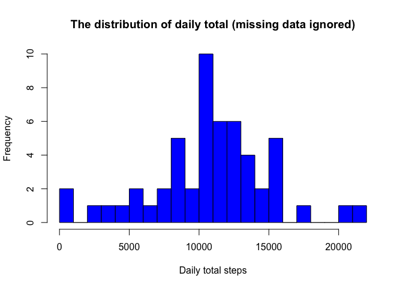
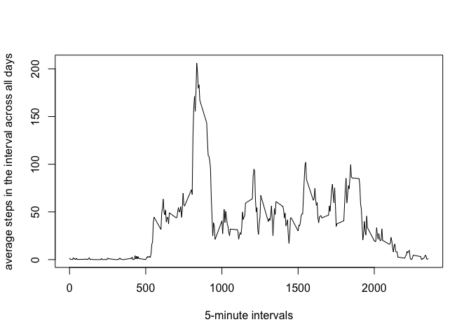
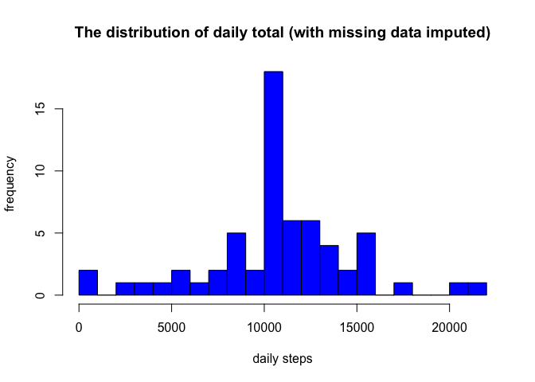

Reproducible Research - Activity Monitoring Project
-------------------------------------------

###Loading and Processing Data

Load the file "activity.csv by read.csv

```r
cls = c("integer", "character", "integer")
act <- read.csv("activity.csv", head=TRUE, colClasses=cls, na.strings="NA")
    head(act)
```

```
##   steps       date interval
## 1    NA 2012-10-01        0
## 2    NA 2012-10-01        5
## 3    NA 2012-10-01       10
## 4    NA 2012-10-01       15
## 5    NA 2012-10-01       20
## 6    NA 2012-10-01       25
```
    
Process/Transform the data into a format suitable for the analysis.

```r
act$date <- as.Date(act$date)
act_final <- subset(act, !is.na(act$steps))
```

###What is mean total number of steps taken per day?

```r
dailysum <- tapply(act_final$steps, act_final$date, sum, na.rm=TRUE, simplify=T)
dailysum <- dailysum[!is.na(dailysum)]
    
hist(x=dailysum,
    col="blue",
    breaks=20,
    xlab="Daily total steps",
    ylab="Frequency",
    main="The distribution of daily total (missing data ignored)") 
```

<!-- -->

###Calculate and report the mean and median total number of steps taken per day.


```r
mn <- mean(dailysum)
```


```r
md <- median(dailysum)
```

The mean is 1.0766189\times 10^{4} and the median is 10765 steps.

###What is the average daily activity pattern?

Create a time series plot of the 5-minute interval (x-axis) and the average number of steps taken, averaged across all days (y-axis).

```r
int_avg <- tapply(act_final$steps, act_final$interval, mean, na.rm=TRUE, simplify=T)
act_ia <- data.frame(interval=as.integer(names(int_avg)), avg=int_avg)

with(act_ia,
     plot(interval,
          avg,
          type="l",
          xlab="5-minute intervals",
          ylab="average steps in the interval across all days"))
```

<!-- -->

Next, show which 5-minute interval, on average across all the days in the dataset, contains the maximum number of steps.


```r
max_steps <- max(act_ia$avg)
act_ia[act_ia$avg == max_steps, ]
```

```
##     interval      avg
## 835      835 206.1698
```

The interval 835 contains maximum number of steps 206.

###Imputing Missing Values

Calculate and report the number of missing values in the dataset.


```r
mis_dat <- sum(is.na(act$steps))
```
The original data set has 2304 rows with missing data.

Create new data set act_input is equal to the original dataset but with the missing data filled in (using mean for that intervak for imputation)


```r
act_input <- act
mis <- is.na(act_input$steps)
act_avg <- tapply(act_final$steps, act_final$interval, mean, na.rm=TRUE, simplify = T)
act_input$steps[mis] <- act_avg[as.character(act_input$interval[mis])]
```

Total number of steps taken each day and calculated reflecting mean and median total number of steps taken per day.


```r
dailysum_upt <- tapply(act_input$steps, act_input$date, sum, na.rm=TRUE, simplify=T)

hist(x=dailysum_upt,
     col="blue",
     breaks=20,
     xlab="daily steps",
     ylab="frequency",
     main="The distribution of daily total (with missing data imputed)")
```

<!-- -->


```r
new_mn <- mean(dailysum_upt)
```


```r
new_md <- median(dailysum_upt)
```

The new mean is 1.0766189\times 10^{4} and the median is 1.0766189\times 10^{4}.  With a comparison for the original mean 1.0766189\times 10^{4} and median 10765, the mean does not change, and the median has a small change.  The new median reflects the same results.

###Are there differences in activity patters between weekdays and weekends?

Create new variable in the dataset with two levels "weekday" and "weekend" with indications.

```r
is_weekday <- function(d) {
    wd <- weekdays(d)
    ifelse (wd == "Saturday" | wd == "Sunday", "weekend", "weekday")
}

wx <- sapply(act_input$date, is_weekday)
act_input$wk <- as.factor(wx)
head(act_input)
```

```
##       steps       date interval      wk
## 1 1.7169811 2012-10-01        0 weekday
## 2 0.3396226 2012-10-01        5 weekday
## 3 0.1320755 2012-10-01       10 weekday
## 4 0.1509434 2012-10-01       15 weekday
## 5 0.0754717 2012-10-01       20 weekday
## 6 2.0943396 2012-10-01       25 weekday
```

Panel plot containing a time series plotm(i.e. type ="1") of the 5-minute interval (x-axis) and the average numbers of steps taken, averaged across all weekday days or weekend das (y-axis).


```r
wk_act <- aggregate(steps ~ wk+interval, data=act_input, FUN=mean)

library(lattice)
xyplot(steps ~ interval | factor(wk),
       layout = c(1, 2),
       xlab="Interval",
       ylab="Number of steps",
       type="l",
       lty=1,
       data=wk_act)
```

<!-- -->

